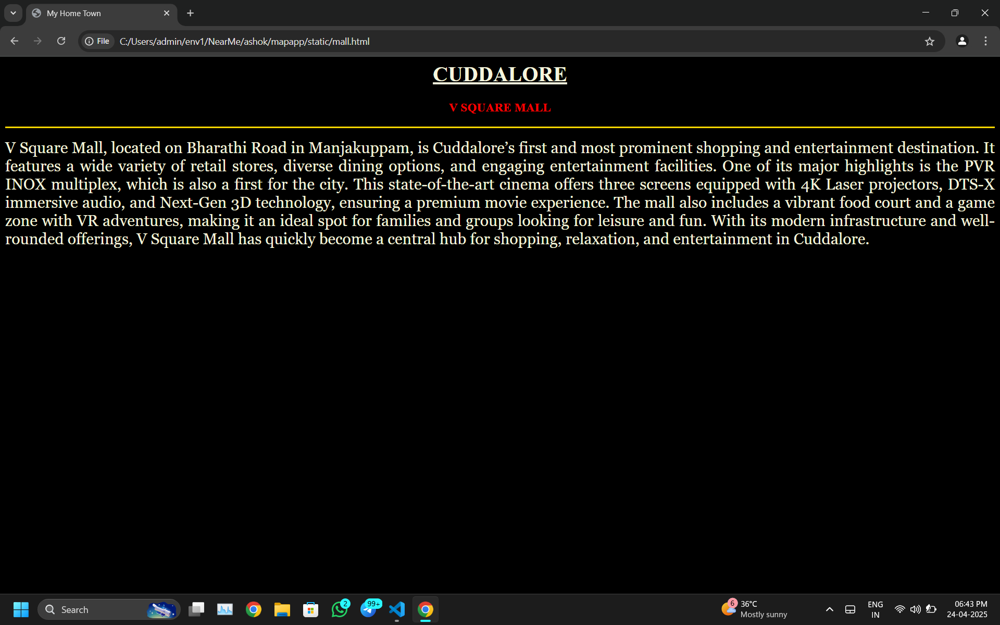

# Ex04 Places Around Me
## Date: 24.04.2025
## REG NO: 212224040031
## NAME: ASHOK S

## AIM
To develop a website to display details about the places around my house.

## DESIGN STEPS

### STEP 1
Create a Django admin interface.

### STEP 2
Download your city map from Google.

### STEP 3
Using ```<map>``` tag name the map.

### STEP 4
Create clickable regions in the image using ```<area>``` tag.

### STEP 5
Write HTML programs for all the regions identified.

### STEP 6
Execute the programs and publish them.

## CODE
```
map.html

<!DOCTYPE html>
<html lang="en">
<head>
  <meta charset="UTF-8">
  <title>MY CITY</title>
</head>
<body bgcolor="beige">
  <h1 align="center"><b>CUDDALORE</b></h1>
  <h3 align="center"><b>ASHOK S (212224040031)</b></h3>
  <center>
  
</center>
  <map name="mymap">
    <area shape="rect" coords="1725,213,1750,262" href="beach.html" alt="CHIDAMBARAM BEACH">
    <area shape="rect" coords="581,390,596,519" href="temple.html" alt=" THILLAI NATARAJA TEMPLE">
    <area shape="rect" coords="118,144,970,154" href="pichavaram.html" alt="PICHAVARAM MANGROVE FOREST">
    <area shape="rect" coords="1452,888,1542,869" href="school.html" alt="ATHENA GLOBAL SCHOOL">
    <area shape="rect" coords="1363,750,1558,813" href="river.html" alt="KOLLIDAM RIVER">
  </map>
</body>
</html>


mall.html

<html>
  <head>
    <title>My Home Town</title>
  </head>
  <body bgcolor="blacK">
    <h1 align="center">
      <font color="beige"><b><u>CUDDALORE</u></b></font>
    </h1>

    <h3 align="center">
      <font color="red"><b>V SQUARE MALL</b></font>
    </h3>

    <hr size="3" color="gold">

    <p align="justify">
      <font color="beige" face="Georgia" size="5">
        V Square Mall, located on Bharathi Road in Manjakuppam, is Cuddalore’s first and most prominent shopping and entertainment destination. It features a wide variety of retail stores, diverse dining options, and engaging entertainment facilities. One of its major highlights is the PVR INOX multiplex, which is also a first for the city. This state-of-the-art cinema offers three screens equipped with 4K Laser projectors, DTS-X immersive audio, and Next-Gen 3D technology, ensuring a premium movie experience. The mall also includes a vibrant food court and a game zone with VR adventures, making it an ideal spot for families and groups looking for leisure and fun. With its modern infrastructure and well-rounded offerings, V Square Mall has quickly become a central hub for shopping, relaxation, and entertainment in Cuddalore.
      </font>
    </p>
  </body>
</html>


beach.html

<html>
  <head>
    <title>My Home Town</title>
  </head>
  <body bgcolor="blacK">
    <h1 align="center">
      <font color="beige"><b><u>CUDDALORE</u></b></font>
    </h1>

    <h3 align="center">
      <font color="blue"><b>SILVER BEACH</b></font>
    </h3>

    <hr size="3" color="gold">

    <p align="justify">
      <font color="beige" face="Georgia" size="5">
        Silver Beach, located just 2 kilometers from downtown Cuddalore in Tamil Nadu, is one of the longest and most serene beaches on the Coromandel Coast. Stretching approximately 57 kilometers along the Bay of Bengal, it ranks among the longest beaches in Asia. Despite its proximity to the town, Silver Beach offers a tranquil escape from urban life, characterized by its soft, silver sands and calm waters. The beach is a popular spot for leisurely walks, sunbathing, and enjoying the scenic beauty of the coastline. While the beach has faced challenges like seafront erosion, it remains a cherished destination for both locals and tourists seeking relaxation and natural beauty. Historically, the area is significant due to the presence of Fort St. David, a 17th-century British fort that played a crucial role during colonial times. Visitors can also explore nearby attractions such as the Pichavaram Mangrove Forest and various temples, making Silver Beach not just a place for recreation but also for cultural and historical exploration.
          </font>
    </p>
  </body>
</html>


stadium.html

<html>
  <head>
    <title>My Home Town</title>
  </head>
  <body bgcolor="blacK">
    <h1 align="center">
      <font color="beige"><b><u>CUDDALORE</u></b></font>
    </h1>

    <h3 align="center">
      <font color="green"><b>ANNA STADIUM</b></font>
    </h3>

    <hr size="3" color="gold">

    <p align="justify">
      <font color="beige" face="Georgia" size="5">
        Anna Stadium in Cuddalore is a prominent sports facility located on Court Main Road in the Anna Kuppakkam area. Serving as a central hub for athletic activities in the region, the stadium is managed by the Sports Development Authority of Tamil Nadu. It offers facilities for various sports, including cricket, football, and athletics. The venue has hosted numerous local cricket matches and tournaments, such as the CDCA Trophy, reflecting its active role in promoting sports at the grassroots level. Additionally, the stadium features a walking and running trail approximately 3.3 miles (7,500 steps) long, making it a popular spot for fitness enthusiasts. With its comprehensive amenities, Anna Stadium continues to be a vital center for sports and recreation in Cuddalore.
          </font>
    </p>
  </body>
</html>


temple.html

<html>
  <head>
    <title>My Home Town</title>
  </head>
  <body bgcolor="blacK">
    <h1 align="center">
      <font color="beige"><b><u>CUDDALORE</u></b></font>
    </h1>

    <h3 align="center">
      <font color="red"><b>PAADALEESWARAR THIRUKOVIL</b></font>
    </h3>

    <hr size="3" color="gold">

    <p align="justify">
      <font color="beige" face="Georgia" size="5">
        Padaleeswarar Temple, located in Thirupathiripuliyur, Cuddalore, is a revered Hindu shrine dedicated to Lord Shiva, known here as Padaleeswarar, and his consort, Periya Nayagi (Parvati). With a history spanning over 2,000 years, the temple was constructed during the Pallava and Chola periods, showcasing the grandeur of Dravidian architecture. Its five-tiered Rajagopuram (gateway tower) and expansive prakarams (corridors) exemplify the architectural brilliance of the era. The temple is classified as a Gnazhar Koil, indicating that the presiding deity is enshrined under a Gnazhar tree, a feature highlighted in ancient Tamil Saiva literature.

This temple holds immense religious significance as one of the 275 Paadal Petra Sthalams, sanctified in the Tevaram hymns by the Nayanmar saints. It is notably associated with Saint Appar (Thirunavukkarasar), who, after being miraculously saved from persecution, embraced Shaivism at this very site. A local belief suggests that a single worship at Padaleeswarar Temple is equivalent to multiple visits to other prominent Shiva temples, underscoring its spiritual prominence.​

Situated near the Thirupathiripuliyur Railway Station and Cuddalore Main Bus Stand, the temple is easily accessible to devotees and tourists alike. Its rich history, architectural splendor, and profound spiritual legacy make Padaleeswarar Temple a significant landmark in Tamil Nadu's religious and cultural landscape.
      </font>
    </p>
  </body>
</html>


fort.html

<html>
  <head>
    <title>My Home Town</title>
  </head>
  <body bgcolor="blacK">
    <h1 align="center">
      <font color="beige"><b><u>CUDDALORE</u></b></font>
    </h1>

    <h3 align="center">
      <font color="blue"><b>ST.DAVID FORT</b></font>
    </h3>

    <hr size="3" color="gold">

    <p align="justify">
      <font color="beige" face="Georgia" size="5">
        Saint David, known in Welsh as Dewi Sant, is the patron saint of Wales. Born around 500 AD in Pembrokeshire, Wales, he was a 6th-century bishop and missionary who played a pivotal role in spreading Christianity throughout the region. He founded a monastic community at Glyn Rhosyn (now St Davids), which became a significant center for Christian learning and pilgrimage. Renowned for his ascetic lifestyle, Saint David advocated for a simple life of prayer, study, and manual labor. He is also associated with several miracles, including restoring a blind man's sight and causing the ground to rise beneath him while preaching, allowing the crowd to see and hear him more clearly. Saint David passed away on March 1, 589 AD, a date now celebrated annually as Saint David's Day in Wales. He was canonized by Pope Callixtus II in 1120, and his legacy endures as a symbol of Welsh identity and spirituality.​
          </font>
    </p>
  </body>
</html>


```

## OUTPUT




## RESULT
The program for implementing image maps using HTML is executed successfully.
